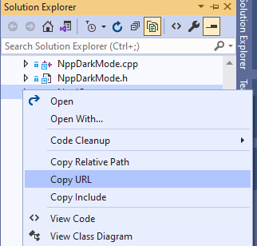

# CopyRelativePath
CopyRelativePath Visual Studio Extension

## Description

This extension adds advanced path copying commands. Available commands:

1. **Copy Relative Path** - Get a relative path to the document. This might be useful when adding a C++ include statement. _Example:_ transform `D:\notepad-plus-plus\PowerEditor\src\resource.h` into `PowerEditor/src/resource.h`.

2. **Copy With Prefix** - Append some text to the relative document path. This might be used to get a GitHub link to the selected document in Visual Studio.
_Example:_ transform `D:\notepad-plus-plus\PowerEditor\src\resource.h`
into `https://github.com/notepad-plus-plus/notepad-plus-plus/blob/master/PowerEditor/src/resource.h`.

The new commands are available in the context menu for a document tab:

Or in the context menu for an item in the Solution Explorer:

Settings can be customized in _Tools > Options > Copy Relative Path Extension_:

