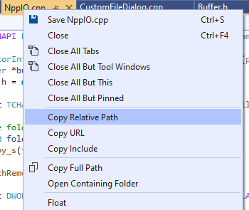

# Copy Relative Path Extension

Download: [Visual Studio Marketplace](https://marketplace.visualstudio.com/items?itemName=mere-human.CopyRelativePath)

## Description

This Visual Studio extension adds advanced path copying commands. Available commands:

1. **Copy Relative Path** - Get a relative path to a selected document. _Example:_ transform `D:\notepad-plus-plus\PowerEditor\src\resource.h` → `PowerEditor/src/resource.h`.

2. **Copy URL** - Append a relative path to a base URL specified in preferences. This might be used to get a GitHub link to the selected document in Visual Studio.
_Example:_ transform `D:\notepad-plus-plus\PowerEditor\src\resource.h`
→ https://github.com/notepad-plus-plus/notepad-plus-plus/blob/master/PowerEditor/src/resource.h.

3. **Copy Current Line URL** - Same as **Copy URL** but link to a specific line. _Example:_ https://github.com/vim/vim/blob/master/Makefile#L100

4. **Copy Include** - Get a relative path while removing directories specified in Include Directories option. Useful for C/C++ projects (`#include` directive).

Extension commands are available in:
1. Context menu for a document tab

2. Context menu for an item in the Solution Explorer:

3. Context menu in the editor

Settings can be customized in _Tools > Options > Copy Path Extension_:

## Links

* File path icon by [Picol](https://icon-icons.com/icon/file-path/71653), [CC BY 4.0](https://creativecommons.org/licenses/by/4.0/)